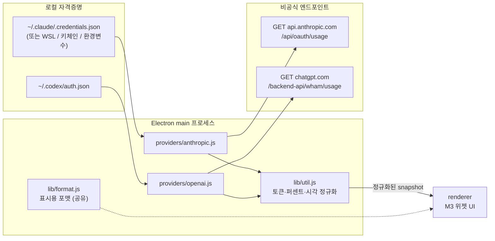

# AI Token Widget

Claude 구독(Pro/Max)과 ChatGPT 구독(Codex)의 **남은 사용량**을 한 화면에 띄우는
Material Design 3 데스크톱 위젯. Electron 기반, Windows 기준으로 작성됨.

## 구조



핵심은 **정규화된 snapshot 한 가지 모양**이다. 두 provider 가 서로 다른 응답을
아래 형태로 바꿔서 넘기고, UI 는 provider 를 몰라도 그릴 수 있다.

```js
{
  provider: 'claude',
  label: 'Claude',
  plan: 'Max 20x',
  windows: [{ key, label, percent /* 0~100 */, resetsAt /* epoch ms */ }],
  extra: { label, used, limit, unit } | null,
  error: null | { code, message, hint }
}
```

## 데이터 출처 (중요)

| 대상 | 방법 | 비고 |
|---|---|---|
| Claude Pro/Max | `GET https://api.anthropic.com/api/oauth/usage` | **비공식**. `anthropic-beta: oauth-2025-04-20` + Claude Code 계열 User-Agent 필요 (다른 UA 는 429) |
| ChatGPT (Codex) | `GET https://chatgpt.com/backend-api/wham/usage` | **비공식**. `chatgpt-account-id` 헤더 사용 |
| ChatGPT 웹/앱 대화 한도 | ❌ 불가 | 공개된 조회 경로가 없음. 이 위젯이 보여주는 건 **Codex 사용량**이다 |
| Anthropic / OpenAI **API 크레딧** | 이 위젯 범위 밖 | 각 콘솔의 Admin API 키가 따로 필요 |

두 엔드포인트 모두 공식 문서에 없다. 언제든 필드명이 바뀌거나 사라질 수 있어서
파서는 알려진 키가 없어도 `utilization` / `used_percent` 를 가진 객체면 창으로 잡도록
방어적으로 작성했다. 토큰은 **읽기만 하고 갱신하지 않는다** — CLI 세션을
로그아웃시키지 않기 위해서다.

## 실행

```powershell
cd ai-token-widget
npm install
npm start
```

UI 만 먼저 보고 싶으면 (네트워크·로그인 불필요):

```powershell
$env:WIDGET_MOCK=1; npm start
```

> `WIDGET_MOCK` 은 PowerShell 세션에 계속 남는다. 실제 값을 보려면 새 창을 열거나
> `Remove-Item Env:WIDGET_MOCK` 으로 지울 것. 모의 데이터일 때는 하단에 `⚠ 모의 데이터` 가 뜬다.

원본 응답을 파일로 떨궈서 확인 (`debug-claude.json`, `debug-codex.json`):

```powershell
$env:WIDGET_DEBUG=1; npm start
```

파서 테스트:

```powershell
npm test
```

### PowerShell 없이 실행

`npm start` 는 PowerShell 에 묶여 있어서 창을 닫으면 같이 꺼진다. 두 가지 방법이 있다.

**1. VBS 런처 (즉시, 추가 설치 없음)**

`run-widget.vbs` 를 더블클릭하면 콘솔 없이 뜨고, 어떤 창을 닫아도 살아 있다.
우클릭 → 바로가기 만들기 → `Win+R` 에 `shell:startup` 을 열어 그 바로가기를 넣으면
로그인할 때 자동 실행된다.

**2. exe 로 패키징 (배포용)**

```powershell
npm i -D electron-builder
npm run build
```

`dist\` 에 두 가지가 나온다.

| 파일 | 용도 |
|---|---|
| `AI-Token-Widget-Setup-1.0.0.exe` | 설치본. 설치 경로 선택 + 시작 프로그램 등록 옵션 + 바로가기 생성 |
| `AI-Token-Widget-1.0.0-portable.exe` | 무설치. 실행하면 바로 뜬다 |

설치본은 **관리자 권한 없이** 사용자 계정에만 설치된다(`perMachine: false`).
설치 중 "추가 옵션" 페이지에서 **Windows 시작 시 자동 실행**을 켜고 끌 수 있다.
등록·해제는 **설치 프로그램만** 담당한다 (`HKCU\Software\Microsoft\Windows\CurrentVersion\Run`
의 `AI Token Widget` 값). 앱이 따로 관리하면 값 이름이 어긋나 같은 exe 를 가리키는 항목이
두 개 생기기 때문이다. 설치 후에 끄고 싶으면 작업 관리자 → 시작 프로그램에서 끄면 되고,
앱을 제거하면 이 값도 함께 지워진다.

서명이 없으므로 처음 실행할 때 SmartScreen 이 "추가 정보 → 실행" 을 요구할 수 있다.

### 빌드 시 흔한 오류

**`Cannot create symbolic link ... winCodeSign ... 클라이언트에 필요한 권한이 없습니다`**

electron-builder 가 코드 서명용 `winCodeSign` 패키지를 푸는데, 그 안에 macOS 용 심볼릭
링크가 들어 있어서 Windows 의 심링크 생성 권한이 필요하다. 서명을 하지 않으므로 애초에
받을 필요가 없는 패키지다. `npm run build` 에 `CSC_IDENTITY_AUTO_DISCOVERY=false` 가
들어 있어 보통은 나지 않지만, 그래도 난다면 둘 중 하나로 해결한다.

- 설정 → 시스템 → 개발자용 → **개발자 모드** 켜기 (심링크 생성 권한이 생긴다)
- 또는 **관리자 PowerShell** 에서 한 번만 빌드 (캐시가 풀리면 이후로는 일반 권한으로 된다)

재시도 전에 망가진 캐시를 지운다.

```powershell
Remove-Item -Recurse -Force "$env:LOCALAPPDATA\electron-builder\Cache\winCodeSign"
```

**PowerShell 에서 `npm` 이 "앱을 선택하여 여세요" 창을 띄운다**

npm 전역 폴더의 확장자 없는 `npm` 파일(리눅스용 sh 스크립트)이 먼저 잡히는 경우다.
`npm.cmd` 로 부르거나 cmd 창에서 실행한다.

### 아이콘

`build/icon.ico` 가 앱·설치본·바로가기 아이콘, `src/assets/tray.png` 가 트레이 아이콘이다.
바꾸려면 256×256 PNG 하나로 다시 만들면 된다.

```powershell
# 예: 파이썬으로 다시 생성
python -c "from PIL import Image; im=Image.open('new.png').convert('RGBA'); im.resize((256,256)).save('build/icon.ico', sizes=[(256,256),(128,128),(64,64),(48,48),(32,32),(24,24),(16,16)]); im.resize((32,32)).save('src/assets/tray.png')"
```

## 조작

| 동작 | 방법 |
|---|---|
| 이동 | 상단 손잡이(얇은 막대) 또는 하단 바 드래그 |
| 새로고침 | 하단 ↻ 버튼, 또는 트레이 메뉴 |
| 항상 위 고정 | 하단 📌 버튼 (토글, 설정에 저장됨) |
| 다크/라이트 | 하단 ◐ 버튼 |
| 숨기기 / 복귀 | 트레이 아이콘 클릭 (작업 표시줄에는 뜨지 않음) |
| 표시할 서비스 | 트레이 우클릭 → 표시할 서비스 (Claude / Codex 체크) |
| 자동 실행 | 설치 중 체크박스로 결정. 이후에는 작업 관리자 → 시작 프로그램에서 끈다 |
| 설정 마법사 | 트레이 우클릭 → 설정 마법사… |
| 종료 | 트레이 우클릭 → 종료 |
| 표시 방식 | 하단 `사용`/`남음` 드롭다운 — ChatGPT·Claude 화면은 "남음"으로 보여주므로 비교할 땐 `남음` |
| 갱신 주기 | 하단 드롭다운 (1/2/5/15분) |

창 위치·테마·주기는 `%APPDATA%\ai-token-widget\config.json` 에 저장된다.

## 설정 마법사

첫 실행이면 위젯 대신 설정 마법사가 먼저 뜬다 (이후에는 트레이 메뉴 → 설정 마법사…).

"첫 실행"의 기준은 설정 파일의 `setupDone` 이고, 설정은 설치 위치가 아니라
`%APPDATA%\ai-token-widget\config.json` 에 있다. 그래서 소스로 한 번 실행해 마법사를
끝낸 뒤 설치본을 깔면 그 설정을 그대로 물려받아 마법사가 뜨지 않는다 — 의도된 동작이다.
다시 보려면 트레이 메뉴에서 열거나, `setupDone` 을 `false` 로 바꾸면 된다.
각 서비스에 대해 **CLI 설치 여부**와 **로그인 여부**를 검사해 뱃지로 보여주고,

- 미설치 → `npm install -g <패키지>` 를 창 안에서 실행하고 로그를 그대로 보여준다
- 로그인 필요 → 별도 콘솔 창을 띄워 `claude` / `codex login` 을 대화형으로 실행한다
  (브라우저 인증이 필요해서 앱 안에서는 처리할 수 없다. 끝나면 '다시 검사')

체크한 서비스만 위젯에 표시된다. npm 자체가 없으면 자동 설치 버튼이 비활성화되고
Node.js 설치 안내가 뜬다.

## 알 수 없는 사용량 항목

Claude 응답에는 문서에 없는 창이 섞여 들어온다 (예: `nimbus_quill`, `spend`).
파서는 이런 키도 버리지 않고 이름 그대로 잡아두되, UI 에서는 숨긴다.
굳이 보고 싶으면 `config.json` 의 `showUnknownWindows` 를 `true` 로 바꾸면 된다
(메뉴에는 노출하지 않는다 — 평소에 의미 없는 항목이라서).

## 설정 파일

```jsonc
{
  "refreshSeconds": 120,
  "theme": "dark",              // "dark" | "light"
  "display": "used",            // "used" = 사용량, "remaining" = 남은 양
  "providers": { "claude": true, "codex": true },  // null 이면 전부 사용
  "showUnknownWindows": false,  // 문서화되지 않은 사용량 항목까지 표시할지
  "setupDone": true,            // false 면 다음 실행 때 설정 마법사부터 뜬다
  "opacity": 0.96,
  "alwaysOnTop": true,
  "bounds": { "x": 1500, "y": 40 },
  "claudeCredentialsPath": null, // 자동 탐색이 실패할 때 직접 지정
  "codexAuthPath": null
}
```

### Claude 자격증명 탐색 순서

1. `CLAUDE_CODE_OAUTH_TOKEN` / `ANTHROPIC_OAUTH_TOKEN` 환경변수
2. `config.json` 의 `claudeCredentialsPath`
3. `%USERPROFILE%\.claude\.credentials.json`
4. WSL 안의 `\\wsl.localhost\<배포판>\home\<user>\.claude\.credentials.json`
5. (macOS) 키체인 `Claude Code-credentials`

Claude Code 를 WSL 에서만 쓴다면 4번이 잡아준다. 그래도 못 찾으면 `claudeCredentialsPath`
에 전체 경로를 직접 넣으면 된다.

## 에러 표시

| 코드 | 화면 문구 | 대처 |
|---|---|---|
| `NO_TOKEN` | 로그인 정보를 찾을 수 없습니다 | 해당 CLI 로 로그인, 또는 경로 직접 지정 |
| `EXPIRED` / `UNAUTHORIZED` | 인증 실패 (재로그인 필요) | `claude` 또는 `codex login` 한 번 실행 |
| `RATE_LIMITED` | 조회 요청이 제한되었습니다 | 갱신 주기를 늘린다 |
| `EMPTY` | 사용량 데이터가 비어 있습니다 | 구독 계정이 아니거나 아직 사용 이력 없음 |

한쪽 provider 가 실패해도 다른 쪽은 정상 표시된다 (`Promise.all` + provider별 에러 스냅샷).

## 파일

```
src/
  main.js                  창·트레이·IPC·갱신 스케줄
  preload.js               contextBridge (nodeIntegration 꺼짐)
  lib/util.js              토큰 로딩·정규화 공통 헬퍼
  lib/format.js            UMD — main/renderer 공유 포맷터
  providers/anthropic.js   Claude
  providers/openai.js      Codex
  renderer/                index.html · styles.css(M3 토큰) · app.js
  setup/                   설정 마법사 (index.html · setup.css · setup.js)
  assets/tray.png          트레이 아이콘
build/
  icon.ico / icon.png      앱·설치본 아이콘
  installer.nsh            NSIS 커스터마이즈 (자동 실행 체크박스)
test/parsers.test.js       모의 응답 기반 파서 테스트 17개
```
